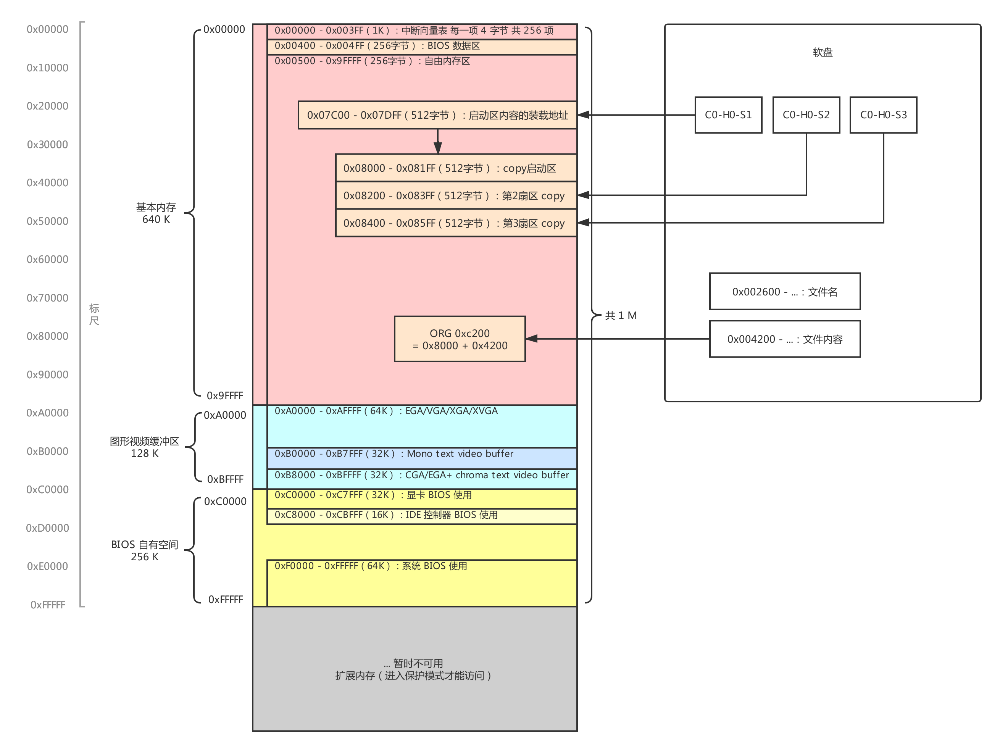
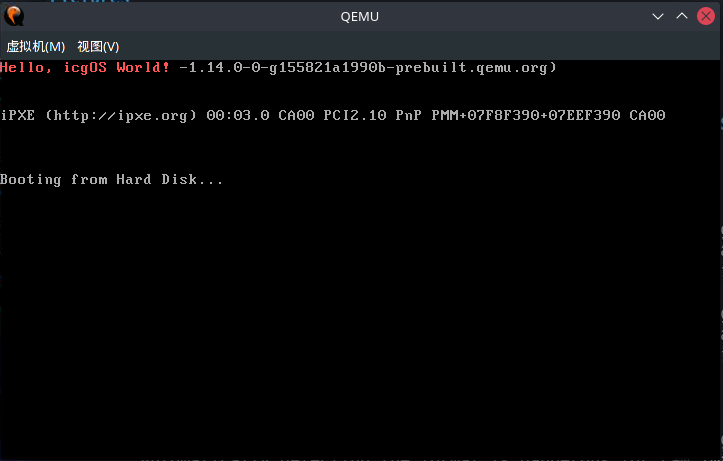
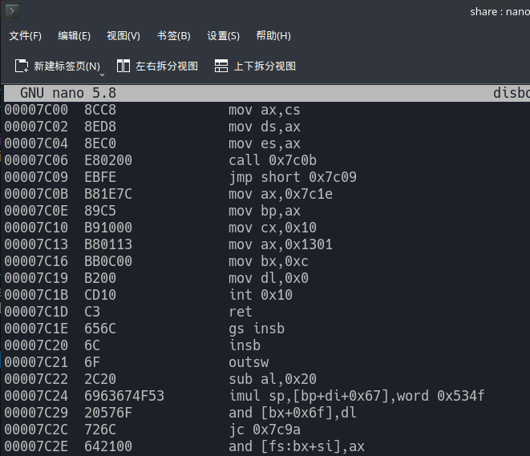

<!--
 * @Author: chengsn
 * @Date: 2021-05-28 16:54:30
 * @LastEditTime: 2021-07-22 16:51:33
 * @LastEditors: chengsn
 * @Description: This is  just a test for C language.
 * @FilePath: \day01\day01.md
 * 可以输入预定的版权声明、个性签名、空行等
-->

## 30 天自制操作系统笔记--Day01

### 安装虚拟环境

由于是在 Windows10 环境下，希望制作操作系统的环境是 Linux 环境，因此在 Windows10 下安装 WSL2，并且在其中安装 Ubuntu 系统，因为 CentOS 不稳定，且有 bug。

#### 1. 安装 WSL

以管理员身份运行 power shell，并键入以下命令：

```bash
dism.exe /online /enable-feature /featurename:Microsoft-Windows-Subsystem-Linux /all /norestart
```

```bash
dism.exe /online /enable-feature /featurename:VirtualMachinePlatform /all /norestart
```

#### 2. 安装 Ubuntu

下载<https://aka.ms/wsl-ubuntu-1804>，安装完成后启动，设置用户及密码。

#### 4. 设置 WSL2

在 power shell 中键入：

```bash
wsl --set-default-version 2
```

可以下载 cmder 作为界面使用。

### 操作系统内存分布图


从上图可以看出，操作系统的启动区起点是从 0x07C00 开始的，从而在写操作系统时，使用语句

```bash
org 0x7c00
```

作为开头。这是告诉操作系统，从这个地址开始将程序装载到内存中的这个地址。
暂时先记录这些，抽时间慢慢学习并做好笔记。写一个操作系统出来。

鉴于 Windows 的 WSL2 图形界面比较捞，最近整了个树莓派，于是在树莓派上安装了 Manjaro 系统，有一说一，这个系统的图形化处理确实非常不错。于是在做了一些配置之后，手动从源码安装了 qemu-6.0.0.

接下来的事情都是在搭建好的环境下进行的。

写好示例的 boot.asm，在 VS Code 打开 Ubuntu 的终端，定位到本目录下，执行如下的代码：

```bash
$ make
nasm boot.asm -o boot.img

$ cp boot.img /mnt/f/sharePi/boot01.img
```

第二条命令是将生成的 img 文件拷贝到树莓派与 windows 挂载的目录中。

在树莓派中运行：

```bash
$ qemu-system-i386 -drive file=boot.img,format=raw
```

将会跳出如下的界面：


下方的表格是字体和背景色显示的代码：

| 二进制数 | 颜色   | 例子       | 二进制数 | 颜色     | 例子          |
| :------- | :----- | :--------- | :------- | :------- | :------------ |
| 0000     | 黑色   | black      | 1000     | 灰色     | gray          |
| 0001     | 蓝色   | blue       | 1001     | 淡蓝色   | light blue    |
| 0010     | 绿色   | green      | 1010     | 淡绿色   | light green   |
| 0011     | 青色   | cyan       | 1000     | 淡青色   | light cyan    |
| 0100     | 红色   | red        | 1100     | 淡红色   | light red     |
| 0101     | 紫红色 | magenta    | 1101     | 淡紫红色 | light magenta |
| 0110     | 棕色   | brown      | 1110     | 黄色     | yellow        |
| 0111     | 银色   | light gray | 1111     | 白色     | white         |

在 boot.asm 文件中的`mov bx, 000ch ; 页号为0(BH = 0), 黑底红字(BL = 0Ch)`这句，显示了背景色和字体颜色，对比上表，若改为`mov bx,00F8`，则表示白底灰字。

理解 boot.asm 中一些符号的含义，比如`$`，则可以对生成的 img 文件进行反汇编：

```bash
$ ndisasm -o 0x7c00 boot.img >> disbott.asm
$ nano disbott.asm
```

第一行表示生成反汇编文件 disbott.asm，第二行是查看文件，如下图所示：



从 ret 开始，后面的内容就是字符串中 ASCII 码内容，不用深究。

第一天可以就这样结束了。如果有这方面的补充，后续再写。
